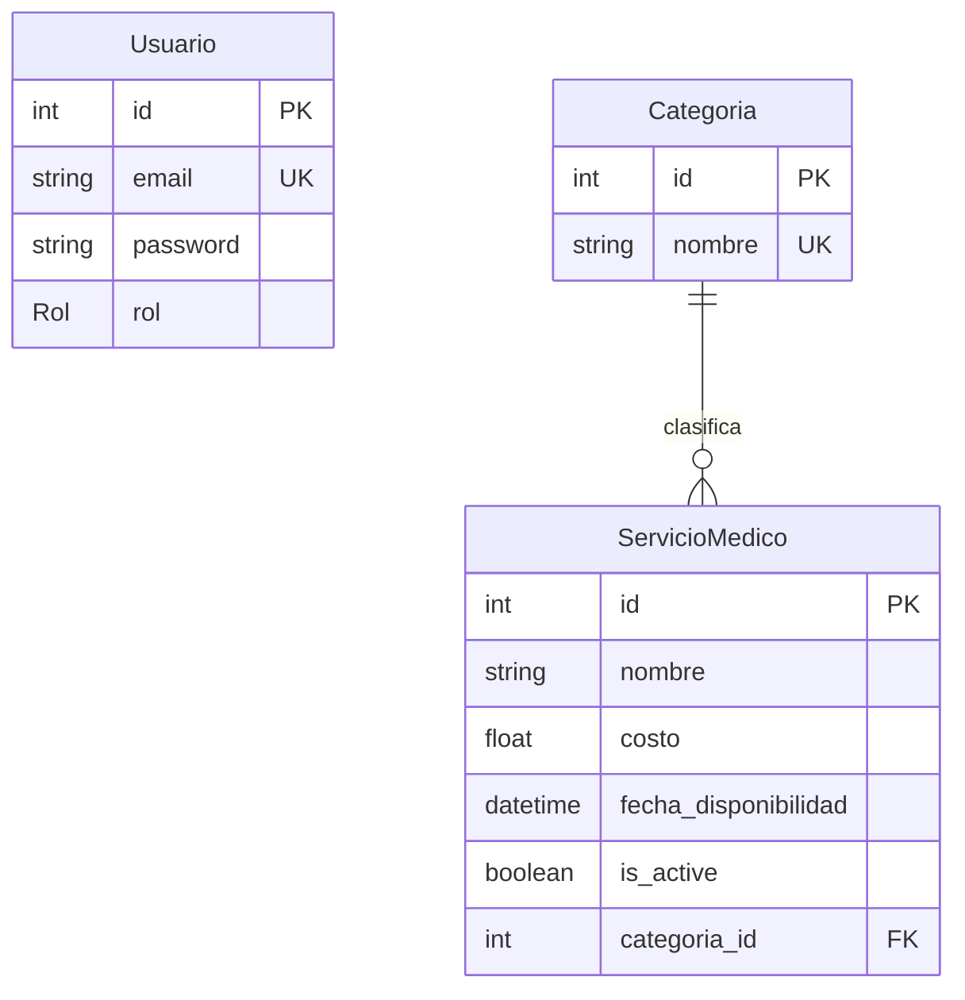

# Medical Service Management API

## Descripción

Esta es una solución robusta desarrollada para la gestión de servicios médicos. El sistema permite a los perfiles administrativos gestionar el catálogo completo de servicios, mientras ofrece a los pacientes (clientes) una plataforma de consulta eficiente con capacidades de filtrado avanzado.

## Stack Tecnológico

| Componente        | Tecnología                                                          |
| ----------------- | ------------------------------------------------------------------- |
| **Framework**     | NestJS v10.x (Node.js)                                              |
| **ORM**           | Prisma v5.15.0 (Versión seleccionada por estabilidad frente a v7.x) |
| **Base de Datos** | PostgreSQL 16 (Imagen Alpine)                                       |
| **Documentación** | Swagger / OpenAPI                                                   |
| **Seguridad**     | Passport JWT + Bcryptjs                                             |
| **Validación**    | Class-validator & Class-transformer                                 |

## Arquitectura del Sistema

Se ha implementado una **Arquitectura en Capas** basada en principios de Clean Architecture para asegurar la mantenibilidad y escalabilidad del código:

1. **Capa de Presentación (Controladores y DTOs):** Encargada de gestionar las solicitudes HTTP, definir los puntos de entrada de la API y validar la integridad de los datos entrantes mediante objetos de transferencia de datos estrictos.
2. **Capa de Aplicación (Servicios):** Contiene la lógica de negocio central, incluyendo el manejo de filtros complejos, validaciones de duplicados y coordinación de operaciones.
3. **Capa de Infraestructura (Prisma):** Gestiona la persistencia de datos y la comunicación directa con la base de datos PostgreSQL.

## Estrategia de Seguridad y Roles (RBAC)

La seguridad del sistema se fundamenta en el Control de Acceso Basado en Roles (RBAC) y la autenticación mediante tokens JWT:

- **Normalización de Datos:** Proceso automático de normalización para correos electrónicos (minúsculas y trim) y nombres (capitalización) durante el registro para garantizar la consistencia en la base de datos.
- **Protección de Rutas:** Implementación de un `RolesGuard` personalizado que intercepta las peticiones y verifica los privilegios del usuario.
- **Matriz de Permisos:**
- **ADMIN:** Acceso total para operaciones de escritura, actualización y eliminación (POST, PATCH, DELETE).
- **CLIENT:** Acceso restringido únicamente a consultas de lectura (GET).

- **Borrado Lógico:** Implementación de integridad referencial mediante el uso de las columnas `is_active` y `deleted_at`, asegurando que los registros no sean eliminados físicamente de la persistencia.

## Diagrama de Entidad-Relación

El modelo de datos define una relación de uno a muchos entre Categorías y Servicios Médicos, permitiendo una clasificación lógica del catálogo.



## Ejecución con Docker

### Pasos para el despliegue:

1. **Clonación del repositorio:**

```bash
git clone https://github.com/VinkeLevinke/gestion-servicios-medicos.git
cd gestion-servicios-medicos

```

2. **Configuración de entorno:**
   Crear un archivo `.env` basado en `.env.example` y ajustar las credenciales de conexión.
3. **Levantamiento de servicios:**

```bash
docker-compose up --build

```

Este comando inicializa tanto la API como la base de datos de forma automática. 4. **Ejecución de Seed (Datos iniciales):**

En una nueva terminal, ejecute el siguiente comando para instanciar el usuario administrador inicial (`admin@medico.com` / `admin123`) y las categorías base:

```bash
npx prisma db seed

```

5. **Documentación interactiva:**
   Acceda a `http://localhost:3000/docs` para consultar y probar los endpoints mediante la interfaz de Swagger.

## Funcionalidades Destacadas

- **Búsqueda Avanzada:** El endpoint `GET /servicios-medicos` integra filtros combinables por nombre (insensible a mayúsculas) y rangos de fechas (desde/hasta) con soporte desde la interfaz de usuario de Swagger.
- **Filtro Global de Excepciones:** Se ha desarrollado un `PrismaExceptionFilter` para interceptar errores específicos del motor de base de datos (como violaciones de unicidad) y transformarlos en respuestas HTTP estandarizadas (409 Conflict).

