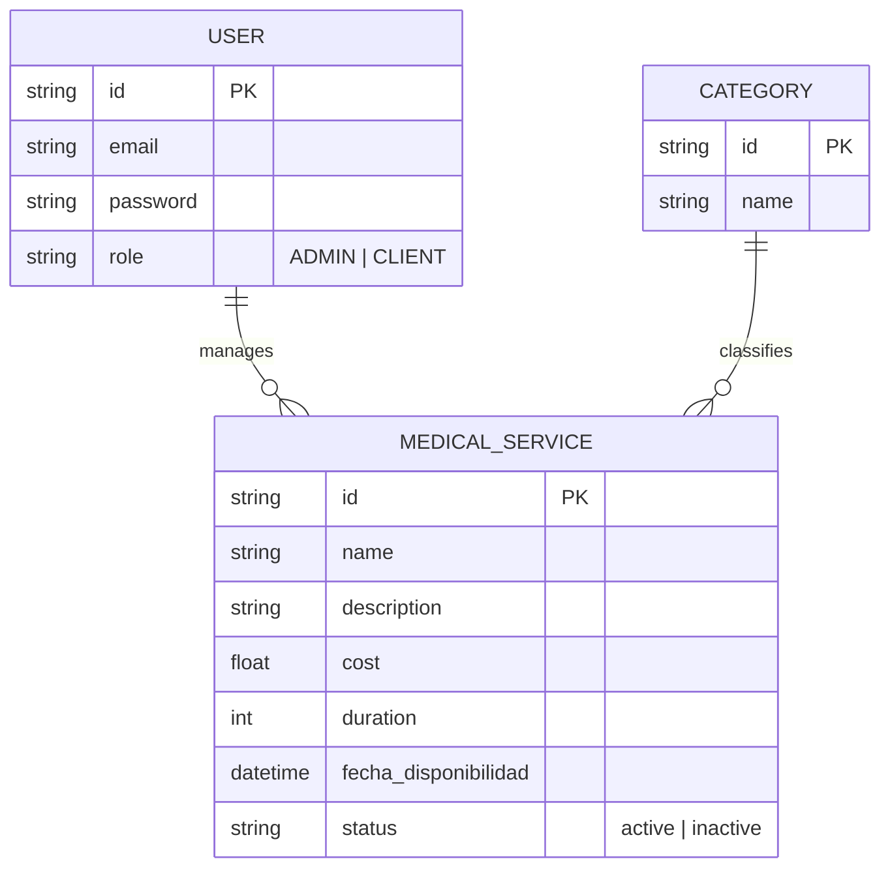

# Medical Service Management API

API REST robusta desarrollada con **NestJS**, **Prisma** y **PostgreSQL** para la gestión eficiente de servicios médicos. El sistema implementa seguridad avanzada, control de acceso basado en roles (RBAC) y una infraestructura totalmente basada en Docker.

## Guía de Inicio Rápido (Docker)

Siga estos pasos para levantar el entorno sin conflictos.

### 1. Clonar y Configurar

```bash
git clone https://github.com/VinkeLevinke/gestion-servicios-medicos.git

cd gestion-servicios-medicos

cp .env.example .env

```

> **Nota:** El archivo `.env.example` se encuentra preconfigurado para establecer comunicación inmediata con la red interna de contenedores.

### 2. Despliegue con un solo comando

```bash
docker-compose up --build

```

#### Justificación técnica

A diferencia de despliegues convencionales que requieren configuraciones manuales, esta API utiliza un flujo de automatización total para garantizar la consistencia del entorno:

- **Construcción Hermética (Dockerfile)**: Se crea un entorno Linux aislado donde se instalan librerías y se ejecuta `npx prisma generate`. Esto asegura que el cliente de base de datos esté disponible antes del arranque sin requerir Node.js local.

- **Orquestación con Docker Compose**: Permite el levantamiento simultáneo de la aplicación y la base de datos PostgreSQL.

- **Script de Inicialización**: Mediante la instrucción `command` en el archivo `docker-compose.yml`, se ejecuta una secuencia lógica automatizada:
- **sleep 10**: Proporciona el tiempo necesario para que PostgreSQL esté operativo antes de recibir conexiones.
- **npx prisma db push**: Sincroniza el esquema de datos con la base de datos de forma automática.

- **npm run db:seed**: Agrega a la base de datos los registros base y el usuario administrador inicial para pruebas inmediatas.

### 3. Verificar Instalación

Una vez finalizado el proceso de carga y aparezca el mensaje de éxito en la terminal, puede acceder a:

- **Documentación Swagger**: [http://localhost:3000/docs].

- **Acceso a Base de Datos (DBeaver / PgAdmin4)**: Host: `localhost` | Puerto: `5433` | Usuario/Password: `postgres` / `postgres`.

---

## Solución de Problemas Comunes

| Error                                         | Causa                                                           | Solución                                                                        |
| --------------------------------------------- | --------------------------------------------------------------- | ------------------------------------------------------------------------------- |
| `Port 3000 is already allocated`              | El puerto 3000 está ocupado por otro proceso local.             | Detenga el proceso que ocupa el puerto o cámbielo en `docker-compose.yml`.      |
| `Port 5432 failed: port is already allocated` | Existe una instancia de PostgreSQL ejecutándose localmente.     | No requiere acción; el sistema mapea el puerto **5433** para el acceso externo. |
| `Can't reach database server`                 | La base de datos aún se encuentra en proceso de inicialización. | El sistema reintentará la conexión automáticamente tras la pausa programada.    |

---

## Mantenimiento y Limpieza (Reset)

Si desea reiniciar la prueba técnica desde cero, eliminando únicamente los datos y contenedores de este proyecto sin afectar otros trabajos de Docker, ejecute:

```bash
# Detiene los contenedores y elimina los datos (volúmenes) asociados a este proyecto
docker-compose down -v

```

Para volver a levantar el entorno limpio:

```bash
docker-compose up --build

```

---

## Arquitectura y Diseño

Se ha implementado una **Arquitectura Limpia (Clean Architecture)** para garantizar la separación de responsabilidades:

- **Capa de Controladores**: Gestiona las peticiones HTTP y asegura la integridad de los datos mediante DTOs y validaciones técnicas.

- **Capa de Servicios**: Centraliza la lógica de negocio, incluyendo filtros de búsqueda y la implementación del **borrado lógico**.

- **Capa de Persistencia**: Gestión de datos tipada mediante Prisma ORM con PostgreSQL.

### Estrategia de Seguridad (RBAC)

Se ha diseñado un esquema de seguridad basado en privilegios mínimos:

- **JWT (Stateless)**: Autenticación basada en tokens para una validación segura.

- **Roles Definidos**: Gestión de permisos diferenciada para perfiles `ADMIN` y `CLIENT`.

- **Guards Personalizados**: Mecanismo que restringe las operaciones de escritura (POST, PATCH, DELETE) exclusivamente al rol `ADMIN`.

---

## Credenciales de Prueba (Configuradas vía Seed) """Para el endpoint de login en swagger, aunque ya lo tengo por defecto usando example"""

- **Usuario Administrador**: `admin@medico.com`
- **Contraseña**: `admin123`

---

## Modelo de Datos (ERD)


