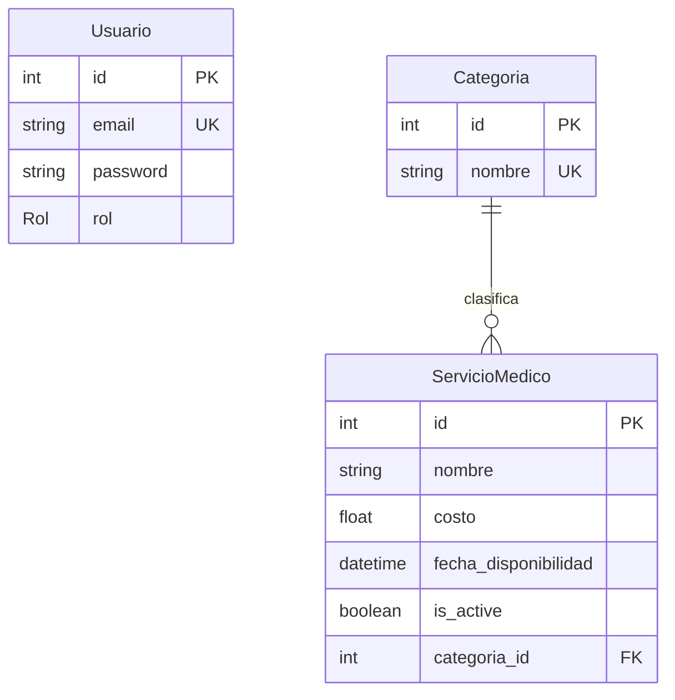

# Medical Service Management API // Gestion-servicios-medicos

Esta es una solución robusta desarrollada para la gestión de servicios médicos. El proyecto permite a los administradores gestionar el catálogo completo mientras ofrece a los pacientes (clientes) una plataforma de consulta rápida y filtrada.

# Tecnologías usadas

Para garantizar la escalabilidad y el tipado fuerte, he utilizado las siguientes tecnologías:

* 
**Framework**: [NestJS] v10.x (Node.js).

* 
**ORM**: [Prisma] v5.15.0 para el modelado de datos.
(Decidí usar esta versión debido a que la versión mas actual de [PRISMA] 7.x.x tenia muchos conflictos, por lo que, decidi cambiar a una mas estable.)

* 
**Base de Datos**: [PostgreSQL:16-alpine].

* 
**Documentación**: [Swagger].

* 
**Seguridad**: [Passport JWT](JasonWebTokens) + [Bcryptjs].

* 
**Validación**: [Class-validator] & [Class-transformer].

## Arquitectura del Sistema:

Se ha implementado una **Arquitectura en Capas (Clean Architecture)** para asegurar una separación clara de responsabilidades:

1. 
**Capa de Presentación (Controllers & DTOs)**: Maneja las solicitudes HTTP y valida la entrada de datos mediante DTOs estrictos.

2. 
**Capa de Aplicación (Services)**: Contiene la lógica de negocio, como el filtrado avanzado de fechas y la gestión de duplicados.

3. 
**Capa de Infraestructura (Prisma)**: Gestiona la persistencia y comunicación con PostgreSQL.

##  Estrategia de Seguridad (RBAC)

La seguridad se basa en **Roles (RBAC)** y autenticación **JWT**:

* **Normalización**: He implementado un sistema que normaliza correos (lowercase/trim) y nombres (Capitalización) automáticamente en el registro para evitar inconsistencias en la BD.
* 
**Protección de Rutas**: Un `RolesGuard` personalizado verifica si el usuario tiene el permiso necesario.

* **Permisos**:
* 
**ADMIN**: Posee control total sobre los servicios (POST, PATCH, DELETE).

* 
**CLIENT**: Solo tiene permisos de lectura (GET).

* 
**Un Borrado Lógico**: Siguiendo las buenas prácticas, los registros nunca se eliminan físicamente; se utiliza la columna `is_active` y `deleted_at` para mantener la integridad referencial.

---

## Diagrama de Entidad-Relación

El modelo cuenta con una relación de uno a muchos entre **Categorías** y **Servicios Médicos**, permitiendo una organización lógica del catálogo.

# Ejecución con Docker

El proyecto está completamente containerizado para facilitar su despliegue.

1. **Clonar el repositorio**:

git clone <url-del-repo>
cd gestion-servicios-medicos

2. **Configurar variables de entorno**:
Copia el archivo `.env.example` a `.env` y ajusta las credenciales si es necesario.

3. **Levantar los servicios**:

docker-compose up --build

Este comando levantará la API y la base de datos PostgreSQL automáticamente.

4. **Poblar la base de datos (Seed)**:
En una nueva terminal, ejecuta el siguiente comando para crear el usuario ADMIN inicial (`admin@medico.com` / `admin123`) y las categorías base:

npx prisma db seed

5. **Acceder a la documentación**:
Visita `http://localhost:3000/docs` para interactuar con la API mediante Swagger.

# Funcionalidades Destacadas

* 
**Búsqueda Avanzada**: El endpoint `GET /servicios-medicos` permite filtrar por nombre (parcial e insensible a mayúsculas) y rangos de fechas mediante selectores interactivos.

* **Gestión de Errores Global**: Se implementó un `PrismaExceptionFilter` que captura errores de base de datos (como duplicados) y los devuelve como respuestas HTTP profesionales (409 Conflict).
