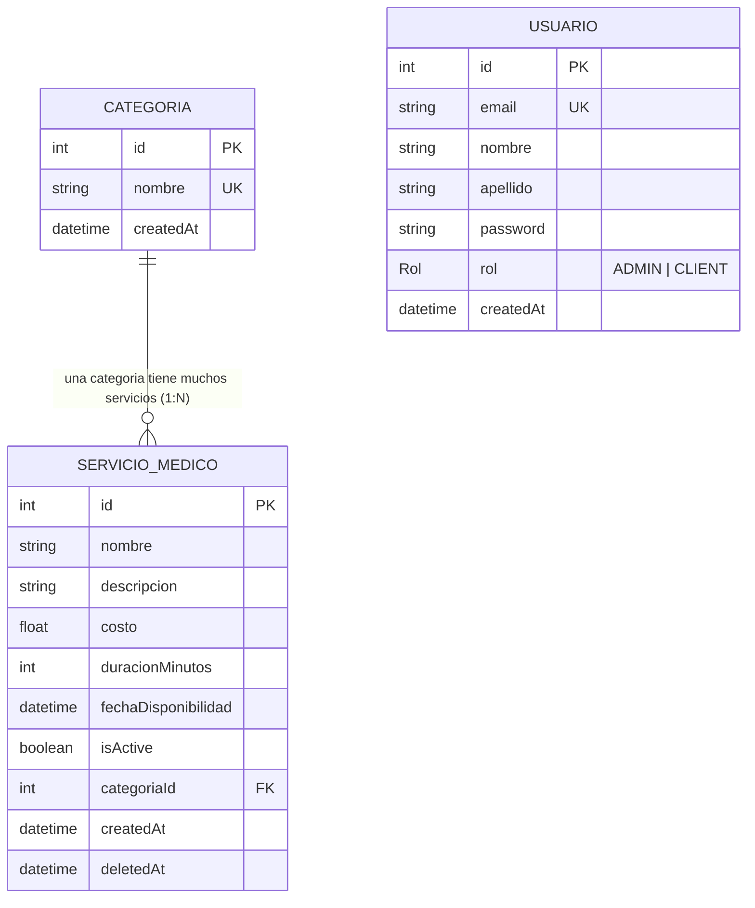

# Medical Service Management API

API REST robusta desarrollada con **NestJS**, **Prisma** y **PostgreSQL** para la gestiónservicios médicos. El sistema implementa seguridad avanzada, control de acceso basado en roles (RBAC) y una infraestructura íntegramente containerizada.

## Requisitos Previos

Para ejecutar este proyecto, es indispensable contar con el siguiente software instalado en su equipo:

- **Docker**: Versión 20.10 o superior.
- **Docker Compose**: Versión 2.0 o superior.
- **Git**: Versión 2.50.0 o superior

---

- **Opcional: GithubDesktop**

---

## Guía de Inicio Rápido

Siga estos pasos para levantar el entorno sin conflictos de dependencias.

### 1. Clonar y Configurar

```bash
git clone https://github.com/VinkeLevinke/gestion-servicios-medicos.git

cd gestion-servicios-medicos

cp .env.example .env

```

> **Nota:** El archivo `.env.example` se encuentra preconfigurado para establecer comunicación inmediata con la red interna de contenedores y definir variables críticas como el `JWT_SECRET`.

### 2. Despliegue con un solo comando

```bash
docker-compose up --build

```

#### Justificación técnica

A diferencia de despliegues convencionales, esta API utiliza un flujo de automatización total para garantizar la consistencia del entorno:

- **Construcción Hermética (Dockerfile)**: Se crea un entorno basado en `node:20-alpine` donde se instalan librerías críticas para el motor de Prisma (`openssl`, `libc6-compat`). Se ejecuta `npx prisma generate` durante la construcción para asegurar que el cliente de base de datos esté disponible antes del arranque.
- **Orquestación con Docker Compose**: Coordina la aplicación y la base de datos PostgreSQL 16.
- **Script de Inicialización**: Mediante la instrucción `command`, se ejecuta una secuencia lógica automatizada:
- **sleep 10**: Tiempo de espera preventivo para la disponibilidad total de PostgreSQL.
- **npx prisma db push**: Sincroniza el esquema de datos sin necesidad de archivos de migración manuales.
- **npm run db:seed**: Puebla la base de datos con categorías y el usuario administrador inicial.

### 3. Verificar Instalación

Una vez finalizado el proceso de carga, puede acceder a:

- **Documentación Swagger**: [http://localhost:3000/docs]
- **Acceso a Base de Datos (DBeaver / PgAdmin4)**:
- **Host**: `localhost`
- **Puerto**: `5433` (Mapeado para evitar conflictos con instancias locales en el puerto 5432)
- **Usuario/Password**: `postgres` / `postgres`

---

## Decisiones Técnicas y Dependencias

### Versiones de Software

**Prisma ORM (v5.15.0)** Durante la fase de desarrollo, la versión 7 presentó comportamientos inesperados al mapear las variables de entorno en contenedores aislados. Ante estos retos de compatibilidad y con el objetivo de entregar una infraestructura robusta y funcional, decidí implementar la versión 5.15. Esta elección técnica asegura que la comunicación entre la API y PostgreSQL en Docker sea inmediata y libre de errores.

### Dependencias Principales

- **@nestjs/swagger**: Para la generación de documentación interactiva.

- **class-validator & class-transformer**: Para la validación estricta de DTOs en los puntos de entrada.

- **passport-jwt & bcryptjs**: Para la gestión segura de identidad y encriptación de credenciales.

---

## Arquitectura y Diseño

El proyecto implementa **Clean Architecture** para garantizar la separación de responsabilidades:

- **Capa de Controladores**: Maneja las peticiones HTTP, define los esquemas de Swagger y aplica los Pipes de validación global.

- **Capa de Seguridad (Guards)**:
- **JwtAuthGuard**: Valida la identidad del usuario mediante el token.

- **RolesGuard**: Verifica los privilegios (`ADMIN` o `CLIENT`) contra los metadatos de la ruta.

- **Capa de Servicios**: Contiene la lógica de negocio y la implementación del borrado lógico (`deletedAt`).

- **Capa de Persistencia**: Gestión de datos mediante Prisma ORM.

---

## Modelo de Datos (ERD)

Diagrama basado en la definición de schema.prisma. Define una relación de Uno a Muchos (1:N): una categoría agrupa múltiples servicios médicos, mientras que cada servicio está vinculado de forma obligatoria a una sola categoría.



---

## Credenciales de Prueba (Configuradas vía Seed)

Utilice estas credenciales para autenticarse en el recurso `/auth/login`:

- **Usuario Administrador**: `admin@medico.com`
- **Contraseña**: `admin123`

---

## Mantenimiento y Limpieza (Reset)

Para reiniciar la prueba técnica desde cero eliminando únicamente los datos y contenedores de este proyecto específico:

```bash
# Detiene contenedores y elimina volúmenes de datos asociados
docker-compose down -v

# Reinicia el entorno limpio
docker-compose up --build

```

---

## Solución de Problemas Comunes

| Error                                 | Causa                                               | Solución                                                                          |
| ------------------------------------- | --------------------------------------------------- | --------------------------------------------------------------------------------- |
| `Port 3000 is already allocated`      | El puerto 3000 está ocupado por otro proceso local. | Detenga el proceso local o ajuste el puerto en el archivo `docker-compose.yml`.   |
| `Port 5432 failed: already allocated` | Instancia de PostgreSQL externa activa.             | No requiere acción; el sistema utiliza el puerto **5433** para el acceso externo. |
| `Can't reach database server`         | PostgreSQL aún está en fase de inicialización.      | El sistema reintenta la conexión automáticamente tras la pausa programada.        |

---
